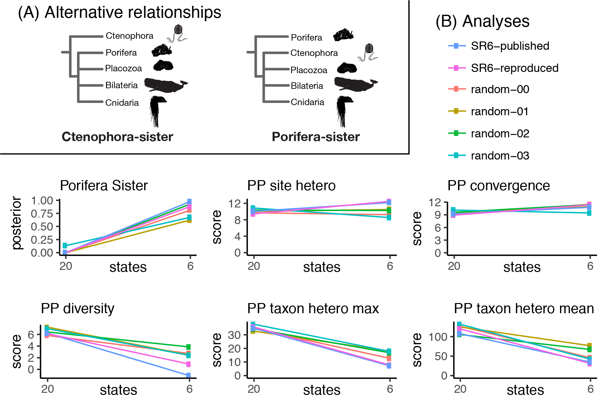
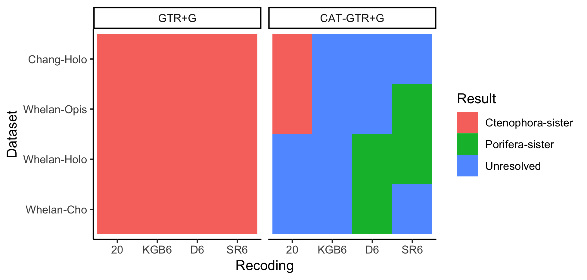
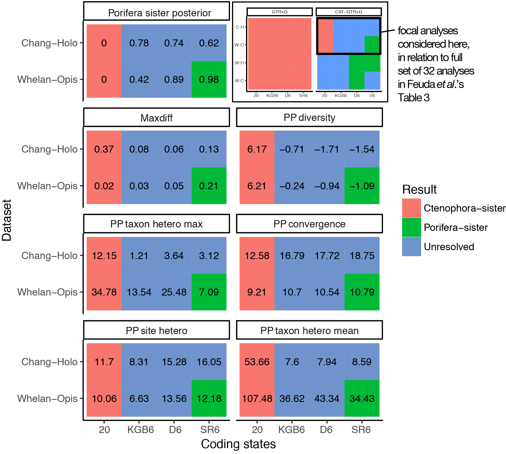

Response to Feuda *et al.*
==========================

Casey W. Dunn

Summary
-------

Feuda *et al.* \[1\] tackled a difficult phylogenetic problem -- placing the root of the animal phylogeny \[2\]. In the past decade, some analyses have placed Ctenophora (comb jellies) and others Porifera (sponges) as the sister group to all other animals (Figure 1A). Feuda *et al.* \[1\] present new phylogenetic analyses that they claim provide strong support for Porifera-sister. Their analyses consider datasets from studies by Chang *et al.* \[3\] and Whelan *et al.* \[4\], both of which found support for Ctenophora-sister. Feuda *et al.* were concerned that these Ctenophora-sister results were artefacts of lineage-specific differences in amino acid frequencies. In an attempt to reduce these differences, they recoded the full set of twenty amino acids into six groups of amino acids. These groups have more frequent evolutionary changes within them than between them, based on empirical observations in large protein datasets \[5\]. The intent is to discard many lineage-specific changes, which are expected to fall within these groups. Rather than model compositional heterogeneity, as their title suggests, this approach discards heterogeneous information so that much simpler models with fewer states can be applied. They report that posterior predictive (PP) analyses \[6\] indicate 6-state recoded analyses have better model adequacy than 20-state amino acid analyses, and "Porifera-sister was favored under all recoding strategies". Here I focus on two aspects of Feuda *et al.* First, I point out that many of their recoded analyses are actually unresolved (*i.e.*, without strong support for either Porifera-sister or Ctenophora-sister), and that the analyses with the best posterior predictive scores do not provide strong support for Porifera-sister. Second, I present new analyses that show the impact of recoding is largely due to discarding information, not accommodating variation in amino acid composition. These findings indicate that it is premature to accept Porifera-sister and reject Ctenophora-sister. They also show that recoding can be a problematic method for addressing compositional variation.

Main Text
---------

Feuda *et al.* examine support for Ctenophora-sister and Porifera-sister under all combinations of two models of molecular evolution, four datasets, and four coding schemes. This provides 32 analyses that they report in their Table 3 and that I present graphically here as Supplemental Figure 1. There is striking variation in support for Ctenophora-sister and Porifera-sister across these analyses (Supplemental Figure 1). Feuda *et al.* accept the results of some analyses and reject others based on posterior predictive (PP) analyses of model adequacy, which assess how well a model explains variation in the data \[6\]. They considered five different posterior predictive statistics that capture different types of variation in the data. From this they conclude that their "results strongly support sponges as the sister group of all other animals".

This conclusion does not follow from their own presented results. Only a single analysis with posterior predictive scores provides what could be considered strong support (&gt; 0.95 posterior probability) for Porifera-sister. Of the 32 analyses, posterior predictive scores were calculated for 16 (those for the full Whelan and Chang matrices). Based on posterior predictive scores, Feuda *et al.* reject eight of these that were conducted under the GTR+G model (which all have strong support for Ctenophora-sister). This leaves eight CAT-GTR+G analyses (Supplemental Figure 2). Two of these eight are analyses of the original 20-state amino acid data, both of which provide strong support for Ctenophora-sister. Of the six recoded analyses, five are unresolved. Only a single analysis for which posterior predictive scores are available provides strong support for Porifera-sister, the CAT-GTR+G analysis of the SR-6 \[5\] recoded Whelan \[4\] matrix. Furthermore, this analysis does not have the best score according to any of the five posterior predictive statistics they considered (Supplemental Figure 2). The only statistic that stands out for this one analysis is that it has the highest maxdiff (Supplemental Figure 2), indicating that it did not converge as well as other analyses.

Though their study does not provide strong support for Porifera-sister, the sensitivity of their results to recoding provides an opportunity to better understand and evaluate the impact of recoding more generally. This is important given the growing interest in recoding \[1\]. Feuda *et al.* hoped recoding would reduce potential artefacts due to differences across species in amino acid frequencies. They interpreted the fact that their analyses are sensitive to recoding as evidence that such an artefact exists and that they successfully addressed it by recoding. An alternative hypothesis is that recoding impacts phylogenetic analyses because it discards so much information. These two hypotheses can be tested by applying new recoding schemes that also reduce twenty states down to six, but are based on random grouping rather than empirical frequencies of amino acid exchange. Empirical and random recodings both discard the same amount of information, but only empirical recoding reduce the impact of amino-acid frequency as intended. Different results between empirical and random recoding would be consistent with the hypothesis that the empirical approach works as intended to accommodate compositional heterogeneity. Similar results would suggest that the impact of recoding is due to discarding information. Here I focus on their single analysis with a posterior predictive score that supports Porifera-sister, the CAT-GTR+G analysis of the SR-6 recoded Whelan data. I created four new random recoding schemes by shuffling the amino acids in the SR-6 scheme (see Supplemental Methods and analysis code at <https://github.com/caseywdunn/feuda_2017>). When I applied each of these randomized codes to the Whelan matrix and analyzed them under the CAT-GTR+G model with phylobayes-mpi \[7\], I observed similar results as for the empirical SR-6 recoding. Like SR-6 recoding, random recoding increases support for Porifera-sister and improves the apparent adequacy of models to explain heterogeneity of states across taxa (PP taxon hetero mean and max, Figure 1B).

These analyses suggest that the major impact of recoding on phylogenetic analyses is data reduction, not accommodation of compositional heterogeneity across species. This indicates that recoding may not be an effective tool for accommodating among-species differences in amino acid frequencies. Compositional heterogeneity would be better addressed with models of molecular evolution that explicitly describe such differences \[8\], if progress can be made on the considerable computational challenges of such complex models.

### Author Contributions

CWD performed all analyses and wrote the manuscript.

### Figure

 **Figure 1.** (A) The two alternative hypotheses for deep animal relationships considered here. Relationships that are not part of these hypotheses are shown as unresolved polytomies. (B) Each of the six plots presents one statistic, which include Posterior probability of Porifera-sister and the five Posterior Predictive (PP) statistics considered by Feuda *et al.* Within each plot, there are six lines for six different analyses. These six analyses are the published SR-6 analyses presented by Feuda *et al.* (SR6-published), analyses obtained by applying the same methods to the same data to to confirm that I can reproduce their published results (SR6-reproduced), and four analyses based on randomized recoding matrices obtained by shuffling the SR-6 coding scheme (random-00 – random-03). Each analysis includes results for 20 states (the raw amino acid data, shown by the left point) and for 6 states (the 6-state recoded data, shown by the right point). For each statistic, the results obtained with the random recoding are similar to those of the SR6 recoding. This indicates that the impact of recoding is dominated by discarding data when collapsing from 20 states to 6 states, not accommodating compositional heterogeneity across lineages.

Supplemental Information
------------------------

### Supplemental methods

All code used for the analyses presented here is available in a git repository at <https://github.com/caseywdunn/feuda_2017_response>. The randomized recoding analyses are in the `recoding/alternative` subdirectory of the git repository.

The original SR-6 recoding scheme is "`APST CW DEGN FHY ILMV KQR`" \[5\], where spaces separate amino acids that are placed into the same group. This recoding is one member of a family of recodings, each with a different number of groups, based on clustering of the JTT matrix. The other recoding used by Feuda *et al.*, KGB-6 and D-6, are based on different matrices and methods \[1\].

The `alt_recode.py` script was used to generate the randomized recoding schemes and apply the recodings to the data. To create the randomized recoding schemes, the amino acids in the SR-6 recoding were randomly reshuffled. This creates new recodings that have the same sized groups as SR-6. The new recodings were, from `random-00` to `random-03`:

    MPKE AY IDGQ TRC WNLF SVH
    EIFT WL QVPG NKM SCHA RYD
    LCQS GK WPTI VRD YEFN MAH
    IWQV TY KDLM ESH APCF GRN

To apply these to the data, each amino acid was replaced with the first amino acid in the group. When applying `random-00`, for example, each instance of `R` and `C` would be replaced by a `T`.

The 20 state matrices are the same across all analyses since they are not recoded. Since all the 20 state matrices are the same, variation between 20-state results (as in the left side of each pane of Figure 1B) give insight into the technical variance of the inference process.

Each new matrix was analyzed with phylobayes-mpi version 1.8. Analyses were run for 1000 generations, and a 200 generation burnin applied. The resulting tree files and posterior predictive scores were parsed for display with the code in `manuscript.rmd`.

The statistics presented in Supplemental Figures 1 and 2 were parsed from the Feuda *et al.* manuscript into the file `tidy_table_3.tsv` and rendered for display with the code in `manuscript.rmd`.

### Supplemental figures

 **Supplemental Figure 1.** A graphical representation of the posterior probabilities for the 32 analyses presented by Feuda *et al.* in their Table 3. Cells are color coded by whether posterior probability is &gt; 0.95 for Porifera-sister, &gt; 0.95 for Ctenophora-sister, or neither (unresolved). Posterior predictive (PP) statistics were estimated for the 16 analyses in the top two rows of this figure (the Chang and full Whelan matrices), but not the bottom two (the Whelan matrices with reduced outgroup sampling).

**Supplemental Figure 2.** The subset of eight CAT-GTR+G analyses with posterior predictive (PP) scores that is the focus of Feuda *et al.*'s primary conclusions. These are a subset of the 32 analyses presented in their Table 3 and graphically here in the upper right pane. The eight analyses are for two datasets (Chang and Whelan) and four coding schemes. The coding schemes are the original 20 state amino acid data, and three different six state recodings that group amino acids based on different criteria: KGB6, D6, and SR6. Cells are color coded as in Supplemental Figure 1. Only one of these analyses, the SR6 coding of the Whelan matrix, has &gt; 0.95 support for Porifera-sister. The 20-state and 6-state points on the plots in Figure 1 of the main text correspond to the 20 and SR6 Whelan cells shown here. The presented statistics for these cells are posterior probability of Porifera-sister, Maxdiff (with lower scores indicating better convergence of runs), and five posterior predictive statistics (where lower absolute value indicates better model adequacy). The only one of these eight analyses that provides strong support for Porifera-sister is not the most adequate analysis by any of the posterior predictive scores, and showed the poorest convergence according to Maxdiff.

References
----------

1. Feuda, R., Dohrmann, M., Pett, W., Philippe, H., Rota-Stabelli, O., Lartillot, N., Wörheide, G., and Pisani, D. (2017). Improved Modeling of Compositional Heterogeneity Supports Sponges as Sister to All Other Animals. Current Biology *27*, 1–12. Available at: <https://doi.org/10.1016/j.cub.2017.11.008>.

2. King, N., and Rokas, A. (2017). Embracing Uncertainty in Reconstructing Early Animal Evolution. Current biology : CB *27*, R1081–R1088. Available at: <https://doi.org/10.1016/j.cub.2017.08.054>.

3. Chang, E. S., Neuhof, M., Rubinstein, N. D., Diamant, A., Philippe, H., Huchon, D., and Cartwright, P. (2015). Genomic insights into the evolutionary origin of Myxozoa within Cnidaria. Proceedings of the National Academy of Sciences, 1–6. Available at: <https://doi.org/10.1073/pnas.1511468112>.

4. Whelan, N. V., Kocot, K. M., Moroz, L. L., and Halanych, K. M. (2015). Error, signal, and the placement of Ctenophora sister to all other animals. Proceedings of the National Academy of Sciences *112*, 201503453–6. Available at: <https://doi.org/10.1073/pnas.1503453112>.

5. Susko, E., and Roger, A. J. (2007). On reduced amino acid alphabets for phylogenetic inference. Molecular Biology and Evolution *24*, 2139–2150. Available at: <https://doi.org/10.1093/molbev/msm144>.

6. Bollback, J. P. (2002). Bayesian model adequacy and choice in phylogenetics. Molecular Biology and Evolution *19*, 1171–1180. Available at: <https://doi.org/10.1093/oxfordjournals.molbev.a004175>.

7. Lartillot, N., Rodrigue, N., Stubbs, D., and Richer, J. (2013). PhyloBayes MPI: phylogenetic reconstruction with infinite mixtures of profiles in a parallel environment. Systematic biology *62*, 611–615. Available at: <https://doi.org/10.1093/sysbio/syt022>.

8. Blanquart, S., and Lartillot, N. (2008). A Site- and Time-Heterogeneous Model of Amino Acid Replacement. Molecular Biology and Evolution *25*, 842–858. Available at: <https://doi.org/10.1093/molbev/msn018>.

9. Foster, P. G. (2004). Modeling compositional heterogeneity. Systematic biology *53*, 485–495. Available at: <https://doi.org/10.1080/10635150490445779>.
